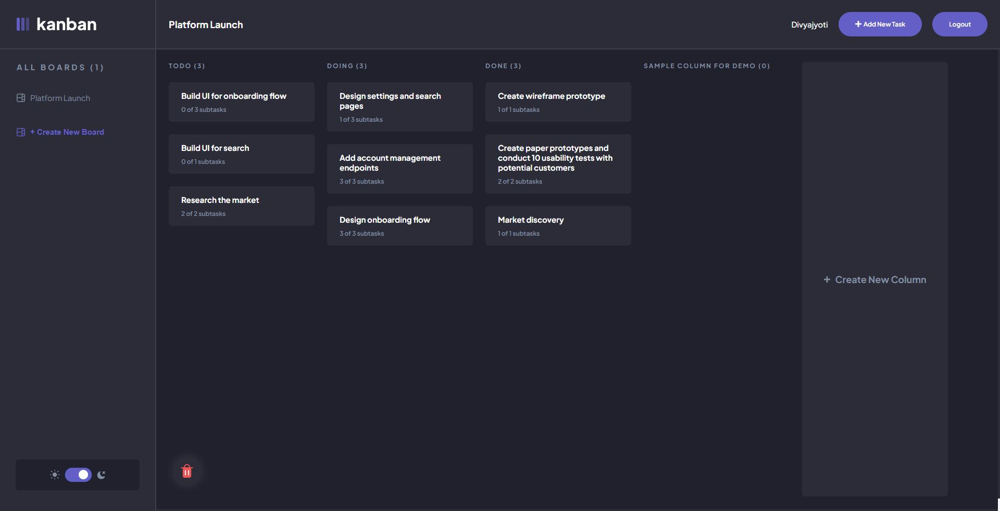

# Frontend Mentor - Kanban task management web app solution

This is a solution to the [Kanban task management web app challenge on Frontend Mentor](https://www.frontendmentor.io/challenges/kanban-task-management-web-app-wgQLt-HlbB). Frontend Mentor challenges help you improve your coding skills by building realistic projects. 

### The challenge

Users should be able to:

- View the optimal layout for the app depending on their device's screen size
- See hover states for all interactive elements on the page
- Create, read, update, and delete boards and tasks
- Receive form validations when trying to create/edit boards and tasks
- Mark subtasks as complete and move tasks between columns
- Hide/show the board sidebar
- Toggle the theme between light/dark modes
- **Bonus**: Allow users to drag and drop tasks to change their status and re-order them in a column
- **Bonus**: Keep track of any changes, even after refreshing the browser (`localStorage` could be used for this if you're not building out a full-stack app)
- **Bonus**: Build this project as a full-stack application

### Screenshot

### Built with

- Semantic HTML5 markup
- CSS custom properties
- Flexbox
- CSS Grid
- scss/sass
- Node.js
- Express.js
- JWT
- Mobile-first workflow
- Redux.js Toolkit
- [React](https://reactjs.org/) - JS library

### What I learned
- Build a full-stack web application using the MERN (MongoDB, Express.js, React.js, and Node.js) stack
- Use Redux for state management, which provided a robust and reliable solution for managing state in a team environment
- Implement user authentication and authorization using JSON Web Tokens (JWT)
- functionality to move tasks between columns
- Deploy the application using Vercel and Render web service

Overall, this project helped me gain hands-on experience with modern web development technologies and provided me with a deeper understanding of full-stack development and best practices. I also learned how to work

### Continued development

Absolutely! The Task Management App is a project that I'm passionate about, and I plan to continue its development in the future.

Some of the features that I'm currently working on include:

Adding notifications for new tasks and updates
Implementing real-time updates using web sockets
Adding the ability to assign tasks to specific users
Integrating the app with popular project management tools like Trello and Asana
Improving the overall performance and scalability of the app
I believe that there is always room for improvement, and I'm excited to keep working on this project and making it even better. Stay tuned for more updates and features in the future!

## Author
- Divyajyoti - [@Divyajyoti1801](https://github.com/Divyajyoti1801)
- Frontend Mentor - [@yourusername](https://www.frontendmentor.io/profile/yourusername)

## Acknowledgments

